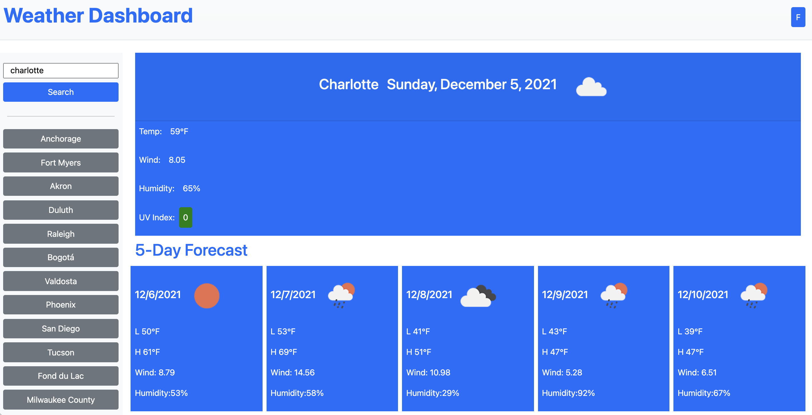

# Weather Dashboard

## Table of Contents
* [Description](#description)
* [Screenshot](#screenshot)
* [Link](#link)
* [Code](#code)
* [Contact](#contact)
* [Technologies](#technologies)
* [Project Status](#project-status)

## Description 
A basic weather dashboard that allows the user to search for a location and be presented with current weather conditions and a five-day forecast.  Previous search locations are added to the interface to allow for future searches with a single click. Duplicate entries are not saved. Supports both Fahrenheit and Celsius, with user preference saved to local storage.

## Screenshot

## Link
[Weather Dashboard](https://johny49.github.io/weather-dashboard/)

## Code
[GitHub Code Repository](https://github.com/Johny49/weather-dashboard)

## Contact 
Created by [@johny49](https://github.com/Johny49/) - feel free to contact me!

## Technologies
- HTML
- JavaScript
- Bootstrap
- Moment
- Open Weather One Call and Geocoding APIs

## Project Status
Project is: completed and functioning as intended.
